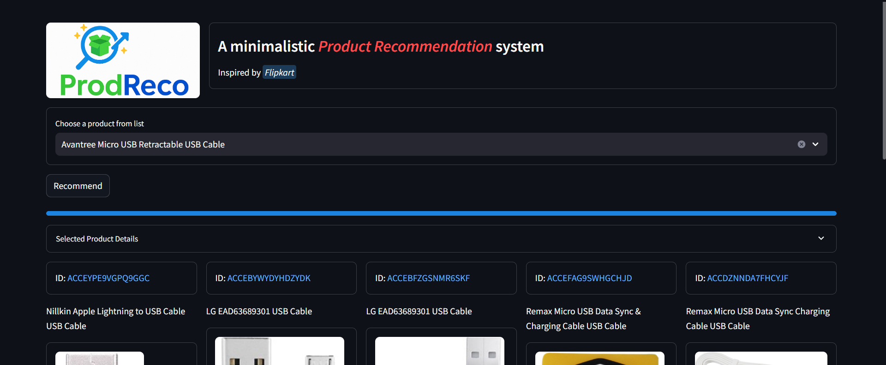
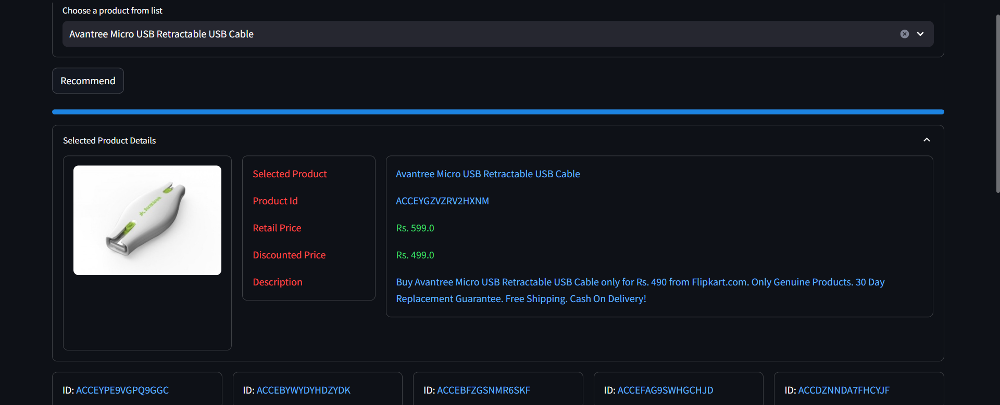
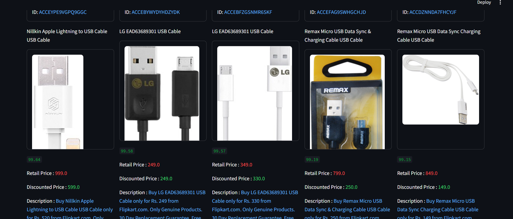

# 🛍️ ProdReco - Product Recommendation System

**ProdReco** is an intelligent product recommendation system built using product data from Flipkart. It leverages Natural Language Processing (NLP) and vector-based similarity techniques to suggest the top 5 most relevant products similar to a given search query. The entire project is deployed as an interactive **Streamlit** app.

---

## 📚 Content-Based Filtering Approach

### 🔎 What is Content-Based Filtering?

**Content-based filtering** is a recommendation technique that suggests items based on the **attributes or content of the items themselves**, rather than relying on user behavior or preferences. It analyzes item features (e.g., product descriptions) and recommends items that are most similar to the item the user is currently viewing or has shown interest in.

This method is highly effective in domains with rich metadata and solves the **cold-start problem**, where user interaction data is limited or unavailable.

---

### ⚙️ How It's Performed in ProdReco

#### 1. 🧹 Preprocessing Product Descriptions

Each product’s title and description are cleaned and normalized to make them suitable for vectorization. The following NLP techniques are applied:

- **Lowercasing**: Converts all text to lowercase to maintain uniformity (e.g., "Shoes" becomes "shoes").

- **Stopword Removal**: Removes commonly used words (like *and*, *the*, *is*) that do not contribute to the semantic meaning of the text.

- **Punctuation and Symbol Removal**: Eliminates punctuation marks and special characters to reduce noise in the text.

- **Stemming**: Reduces words to their root form by removing suffixes (e.g., *running*, *runs*, *ran* → *run*). This is a crude heuristic approach, using libraries like `nltk.PorterStemmer`.

- **Lemmatization**: Converts words to their base or dictionary form (e.g., *better* → *good*, *studies* → *study*), using context-aware rules. More accurate than stemming and performed using libraries like `spaCy` or `WordNetLemmatizer`.

These steps help in reducing dimensionality and making the text data more uniform for vectorization.

---

#### 2. 🧠 Vectorization of Product Content

After preprocessing, product descriptions are converted into numeric vectors using various vectorization techniques:

- **Bag of Words (BoW)**: Represents text as a frequency count of each word in the vocabulary. Simple but doesn't capture word order or meaning.

- **TF-IDF (Term Frequency–Inverse Document Frequency)**: Measures the importance of a word in a document relative to a collection of documents. Helps reduce the weight of common words and highlight distinctive ones.

- **Word2Vec**: A neural embedding model that represents words in a continuous vector space where semantically similar words are close together. Captures **contextual and semantic relationships** between words.

- **GloVe**: Stands for Global Vectors. Similar to Word2Vec but focuses on capturing **word co-occurrence statistics** across the entire corpus.

- **FastText**: An extension of Word2Vec that also considers **subword information**, which helps with out-of-vocabulary words.

👉 In this project, **Word2Vec** was found to work best for capturing meaningful product relationships in the Flipkart dataset.

---

#### 3. 📐 Cosine Similarity for Recommendations

Once the descriptions are vectorized, we use **cosine similarity** to measure how similar two product vectors are.

##### ✅ What is Cosine Similarity?

**Cosine similarity** calculates the cosine of the angle between two vectors in an n-dimensional space. It is widely used to determine **textual similarity**, especially in high-dimensional spaces like NLP.

##### 📊 Mathematical Formula:

\[\text{cosine\_similarity}(A, B) = \frac{A \cdot B}{\|A\| \|B\|} = \frac{\sum_{i=1}^{n} A_i B_i}{\sqrt{\sum_{i=1}^{n} A_i^2} \cdot \sqrt{\sum{i=1}^{n} B_i^2}}\]

Where:
- \( A \) and \( B \) are the vector representations of two product descriptions
- \( A \c dot B \) is the dot product of the vectors
- \( \|A\| \) and \( \|B\| \) are the Euclidean norms (magnitudes)

##### 🎯 What Does It Mean?

- A cosine similarity value of **1** means the vectors are identical (i.e., descriptions are highly similar).
- A value of **0** means the vectors are orthogonal (i.e., no similarity).
- The closer the value is to 1, the more similar the product descriptions are.

Using this method, we compute the similarity of the input product to all other products and sort them by similarity score.

---

#### 4. 🎁 Recommendation Generation

Based on the similarity matrix obtained from cosine similarity:

- The system identifies the **top 5 products** with the highest similarity scores
- These are presented to the user as recommendations
- Each recommendation includes a **similarity score** indicating how close it is to the searched product

This approach ensures that users receive **contextually similar products**, making the shopping experience more intuitive and personalized.

---

## 🔍 Tech Stack

- **Language**: Python 3.11  
- **NLP Libraries**: NLTK, SpaCy, Gensim  
- **Vectorization**: Scikit-learn, Tensorflow, Gensim 
- **Web App**: Streamlit  
- **Data**: Flipkart Product Dataset (CSV)

---

## 🧠 Methodology

1. **Data Preprocessing**
    - Removal of stopwords, punctuation, special characters, and symbols
    - Applied stemming and lemmatization for normalization
    - Cleaned product titles and descriptions

2. **Corpus Creation**
    - Constructed a text corpus from cleaned product descriptions
    - Tokenized and embedded the corpus using various vectorization techniques

3. **Similarity Computation**
    - Applied `cosine similarity` on the embedded corpus
    - Built a similarity matrix to identify the top 5 similar products

4. **Recommendation Engine**
    - User inputs a product name or keyword
    - App returns 5 closest matching products along with similarity scores

---

## 📸 Screenshot

 
 
 


---

## 🧪 How to Run Locally

1. **Clone the repository**:
   ```bash
   git clone https://github.com/yourusername/ProdReco.git
   cd ProdReco

2. **Install dependencies**:
    ```bash 
    pip install -r requirements.txt

3. **Run the Streamlit app**:
    ```bash
    streamlit run app.py

## 🎯 Future Improvements
1. Integrate deep learning-based embedding models like BERT or SBERT

2. Add user login and history-based recommendations

3. Expand dataset for multi-category recommendation

4. Deploy as a web service via Docker or cloud platforms

## 🙌 Acknowledgments
1. Flipkart Dataset ([Kaggle](https://www.kaggle.com/datasets/PromptCloudHQ/flipkart-products))

2. NLTK, SpaCy, Gensim

3. Streamlit